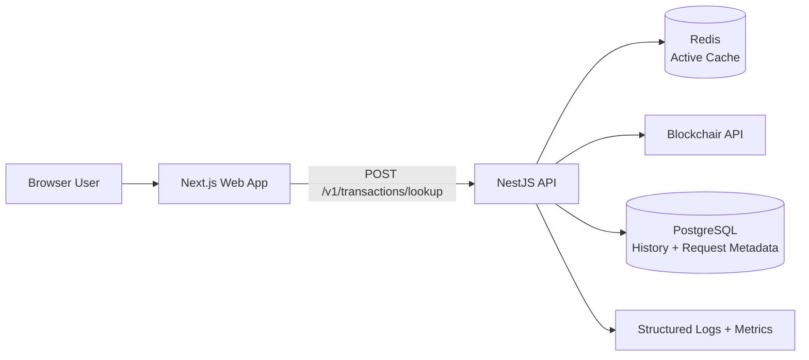

# Crypto Omnichain Transaction Tracker — MVP Spec

## Status

**Project:** Crypto Omnichain Transaction Tracker
**Status:** Specification ready for implementation planning
**Primary goal:** Build a credible, deployed portfolio MVP that demonstrates clean full-stack architecture, external API resilience, Redis cache-aside, observability, and disciplined delivery. Do not claim performance or API savings until measured on real traffic.

## Product Definition

Crypto Omnichain Transaction Tracker is a web application for looking up a **single supported EVM transaction hash**. A user submits a transaction hash and selected chain; the system retrieves normalized transaction data from Blockchair, uses Redis to reduce repeated upstream calls, and presents a readable result.

The word “omnichain” in this MVP means the architecture is designed to support multiple chains through provider adapters. It does **not** mean the system can prove or trace cross-chain bridge paths in V1.

## Problem and Value

Blockchain transaction data is fragmented across chain-specific explorers. The MVP provides a single, consistent lookup experience for supported chains while protecting a third-party API quota through request validation, application rate limiting, and cache-aside Redis.

The portfolio value is not the UI alone. The project should demonstrate:

- Clear separation between frontend, backend, provider adapter, cache, persistence, and metrics
- Typed API contracts shared between NestJS and Next.js
- Safe handling of an unreliable/rate-limited third-party API
- Measurable cache behavior and deployment readiness

## MVP Scope

### In scope

- Lookup exactly one transaction hash at a time
- User explicitly selects a supported chain before searching
- Initial supported chains: Ethereum, BNB Smart Chain, Polygon
- Validate EVM transaction-hash format before provider request
- Fetch transaction data through a Blockchair provider adapter
- Redis cache-aside for normalized successful lookup results
- Persist anonymous session and search history in PostgreSQL
- Persist minimal provider request metadata for observability; do not persist raw full provider responses by default
- Display transaction hash, chain, status, from, to, value, fee, block number, timestamp, and provider/explorer link when available
- Clear loading, empty, validation-error, upstream-error, and rate-limit states
- Public API rate limiting and request timeout handling
- Health endpoint and basic application metrics
- Responsive UI with accessible search form

### Explicitly out of scope

- Wallet-address lookup
- Automatic chain detection from a transaction hash
- Cross-chain bridge status or bridge-path analysis
- User registration, login, password reset, OAuth, or personalized dashboard
- Multi-hash/batch search
- Real-time transaction monitoring, webhook subscriptions, email/Discord alerts
- Full analytics dashboard and Grafana in V1
- Solana, Avalanche, Bitcoin, and non-EVM chain support
- Payments, premium plan, or API-key management for end users

## Product Decisions

| Topic                  | Decision                                                                                            | Reason                                                                                                                |
| :--------------------- | :-------------------------------------------------------------------------------------------------- | :-------------------------------------------------------------------------------------------------------------------- |
| Search input           | Transaction hash only                                                                               | Keeps validation, provider mapping, and UI focused                                                                    |
| Chain choice           | User-selected chain                                                                                 | A hash alone does not safely identify its originating chain                                                           |
| Authentication         | No auth in MVP                                                                                      | Anonymous session is enough for short search history and reduces scope                                                |
| Provider               | Blockchair behind an adapter                                                                        | Avoid coupling application logic directly to one HTTP response format                                                 |
| Active cache           | Redis only                                                                                          | Avoid duplicate cache sources of truth                                                                                |
| PostgreSQL cache table | No                                                                                                  | Database records history and observability, not active response cache                                                 |
| Repository             | Two separate GitHub repositories: `crypto-omnichain-tracker-api` and `crypto-omnichain-tracker-web` | Explicit frontend/backend separation for portfolio showcase; cross-repo API contract must be versioned and documented |
| Runtime                | Next.js web + NestJS API                                                                            | Deliberately shows clear frontend/backend boundaries for portfolio value                                              |
| Deployment             | One Ubuntu VPS + Nginx + PM2                                                                        | Lower operational complexity than Docker orchestration for V1                                                         |

## User Flow

1. User opens the web application.
2. User chooses a chain: Ethereum, BNB Smart Chain, or Polygon.
3. User pastes one EVM transaction hash and submits the form.
4. Frontend performs basic client-side validation, then calls `POST /v1/transactions/lookup`.
5. Backend validates the request again and applies rate limiting.
6. Backend constructs a canonical Redis key from provider version, chain, and lowercase hash.
7. If the Redis key exists, backend returns the normalized cached result with `cache.hit = true`.
8. If no cached value exists, backend calls Blockchair through `BlockchairClient` with an explicit timeout.
9. Backend normalizes the provider response into the internal transaction DTO.
10. Backend stores only a successful normalized response in Redis with a configurable TTL.
11. Backend logs request metadata in PostgreSQL and records search history for the anonymous session.
12. Frontend renders the result or an actionable error state.

## Functional Requirements

### Input rules

- Accept exactly one EVM transaction hash.
- Required format: `0x` followed by 64 hexadecimal characters.
- Chain is required and must be one of `ethereum`, `bsc`, or `polygon`.
- Reject invalid requests with HTTP 400 before Redis or Blockchair access.

### Transaction lookup

- Only call the provider through an adapter/service boundary.
- Normalize provider-specific field names before returning data to frontend.
- Treat provider data as untrusted external input: validate/mapping-check it before use.
- Cache only successful, normalized lookup results.
- Do not cache malformed responses or internal errors.

### Anonymous session

- On first request, issue an opaque, secure, HTTP-only session cookie.
- Persist only the session identifier and lifecycle timestamps in PostgreSQL.
- Do not collect wallet ownership, personal profile data, or credentials.
- Search history is scoped to that anonymous session only.

### Error behavior

- Invalid hash or unsupported chain: `400 Bad Request`.
- Transaction absent/not found from provider: `404 Not Found`.
- Upstream provider timeout/unavailable: `502 Bad Gateway`.
- Upstream provider rate limited: `503 Service Unavailable` with retry guidance; do not expose upstream secrets.
- Application rate limit reached: `429 Too Many Requests`.
- Return a stable error payload; never leak stack traces, Redis URLs, database errors, or API keys.

## Non-Functional Requirements

### Security

- All secrets live in environment variables; provide only `.env.example` in Git.
- Never commit API keys, database URLs, Redis URLs, session secrets, logs containing secrets, or `.env` files.
- Validate every API request server-side.
- Use a global validation pipe with whitelist and forbid-non-whitelisted behavior in NestJS.
- Use CORS allowlist for the deployed web origin.
- Set secure cookie flags in production: `HttpOnly`, `Secure`, `SameSite=Lax` (or stricter if compatible).
- Rate-limit the lookup endpoint per IP; Redis-backed storage is preferred for distributed correctness.
- Add provider timeout, bounded retries only for safe transient failures, and structured error mapping.

### Reliability

- Redis unavailability must not crash the API. Degrade to provider lookup and log the cache failure.
- Database logging/history failure must not prevent a valid lookup response; log the persistence failure.
- Provider adapter must be mockable for unit tests.
- Health endpoint must separately report liveness and dependency readiness without exposing secret values.

### Performance targets (not measured claims)

- Cached successful lookup target: p95 below 200 ms in the deployed environment.
- Uncached successful lookup target: p95 below 2 seconds, subject to provider behavior.
- Cache hit-rate target after real usage: above 80% only if traffic patterns make it realistic.
- These are targets to measure, not figures to publish before measurement.

### Observability

- Produce structured logs with request ID, route, chain, cache outcome, latency, HTTP status, and sanitized provider outcome.
- Never log full API keys, cookies, raw authorization headers, or unnecessary raw provider response bodies.
- Expose a minimal metrics endpoint or stats service for aggregate counters:
  - lookup total
  - cache hit total
  - cache miss total
  - provider error total
  - lookup latency
- Store `ApiRequestLog` as metadata only; keep raw payload logging disabled by default.

## Architecture



### Repository layout

The project uses two GitHub repositories. API contract ownership belongs to the backend repository; the frontend consumes the published/versioned contract and must not duplicate backend DTO definitions without a documented reason.

#### crypto-omnichain-tracker-api

```plain text
crypto-omnichain-tracker-api/
├── src/
│   ├── health/
│   ├── sessions/
│   ├── transactions/
│   ├── providers/blockchair/
│   ├── cache/
│   ├── history/
│   ├── observability/
│   └── common/
├── prisma/
│   └── schema.prisma
├── test/
├── docs/
│   └── api-contract.md
├── infra/
│   ├── nginx/
│   └── pm2/
├── .env.example
└── README.md
```

#### crypto-omnichain-tracker-web

```plain text
crypto-omnichain-tracker-web/
├── app/
│   ├── page.tsx
│   └── result/[chain]/[transactionHash]/page.tsx
├── components/
├── lib/
│   ├── api-client.ts
│   ├── api-types.ts
│   └── validation.ts
├── public/
├── docs/
│   └── api-contract-reference.md
├── .env.example
└── README.md
```

## Data Model (ERD)

```mermaid
erDiagram
    USER_SESSION ||--o{ SEARCH_HISTORY : has

    USER_SESSION {\n        uuid id PK\n        string session_id UK\n        timestamp created_at\n        timestamp last_active_at\n        timestamp expires_at\n    }

    SEARCH_HISTORY {\n        uuid id PK\n        uuid user_session_id FK\n        string transaction_hash\n        string chain\n        string outcome \"success|not_found|validation_error|upstream_error|rate_limited\"\n        boolean cache_hit\n        timestamp searched_at\n    }

    API_REQUEST_LOG {\n        uuid id PK\n        string request_id UK\n        string provider \"blockchair\"\n        string endpoint\n        string chain\n        string cache_outcome \"hit|miss|bypass|error\"\n        int upstream_status_code\n        int total_duration_ms\n        int provider_duration_ms\n        string outcome \"success|not_found|upstream_error|rate_limited\"\n        timestamp created_at\n    }
```

## Redis Cache Contract

### Key format

```plain text
transaction:v1:{chain}:{lowercase_transaction_hash}
```

### Value

Store a JSON representation of the internal normalized transaction response, not the raw Blockchair response.

### TTL

- Start with a configurable TTL of 1 hour for confirmed transactions (`TRANSACTION_CACHE_TTL_SECONDS=3600`).
- Cache failure: log and bypass cache; do not fail a valid provider lookup solely due to Redis.
